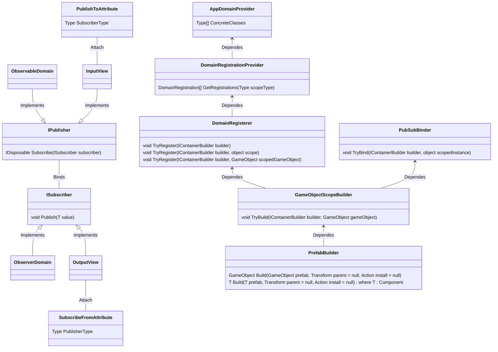

# BinDI (Bindy)
Provides automatic binding of pub/sub events.



# Dependencies
- [UnityEngine](https://unity.com/)
- [VContainer](https://github.com/hadashiA/VContainer)
- [UniRx](https://github.com/neuecc/UniRx) or [R3](https://github.com/Cysharp/R3)
- (Optional) [UniTask](https://github.com/Cysharp/UniTask)
- (Optional) [AddressableSystem](https://docs.unity3d.com/Packages/com.unity.addressables@1.21)

# Installation
Place [BinDI.cs](https://github.com/Chichiche/BinDI/blob/main/BinDI.cs) anywhere in your project.

# Getting Started
At first, register BinDI to container builder.
```
containerBuilder.RegisterBinDI();
```
Then, the following types have been registered:
- `DomainRegisterer`
- `PubSubBinder`
- `GameObjectScopeBuilder`
- `PrefabBuilder`

Usually, setting up SceneRootGameObject is done using the GameObjectScopeBuilder.
```
objectResolver.CreateScope(containerBuilder =>
{
  objectResolver.Resolve<GameObjectScopeBuilder>().TryBuild(containerBuilder, gameObject);
});
```

Additionally, building DynamicGameObject is done using the PrefabBuilder.
```
prefabBuilder.Build(prefab, parent, containerBuilder =>
{
  containerBuilder.RegisterInstance(someObject);
});
```

# Automatic Registration
use `RegisterTo` Attribute.

```
[RegisterTo]
public class Hoge {
```

```
[RegisterTo(12345)]
public class Hoge {
```

```
[RegisterTo(typeof(ScopedComponent))]
public class Hoge {
```

# Automatic Connecting
use `SubscribeFrom` Attribute.

```
[SubscribeFrom(typeof(SomePublisher))]
public class Hoge : ISubscriber {
```

use `PublishTo` Attribute.
```
[PublishTo(typeof(SomeSubscriber))]
public class Hoge : IPublisher {
```
